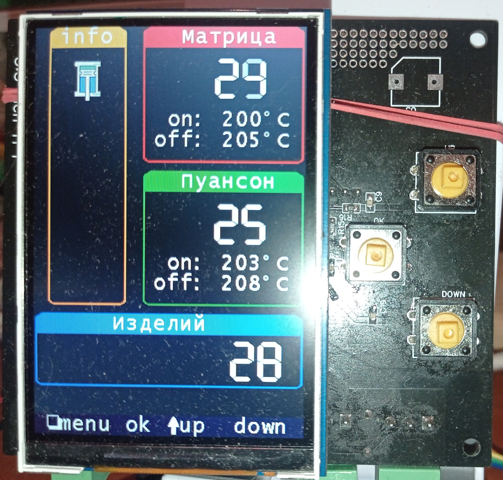

CAN TFT module 
TFT module based on STM32 for displaying real-time information received via the CAN bus
from various devices and organizing menus for setting up and controlling equipment and other devices.

